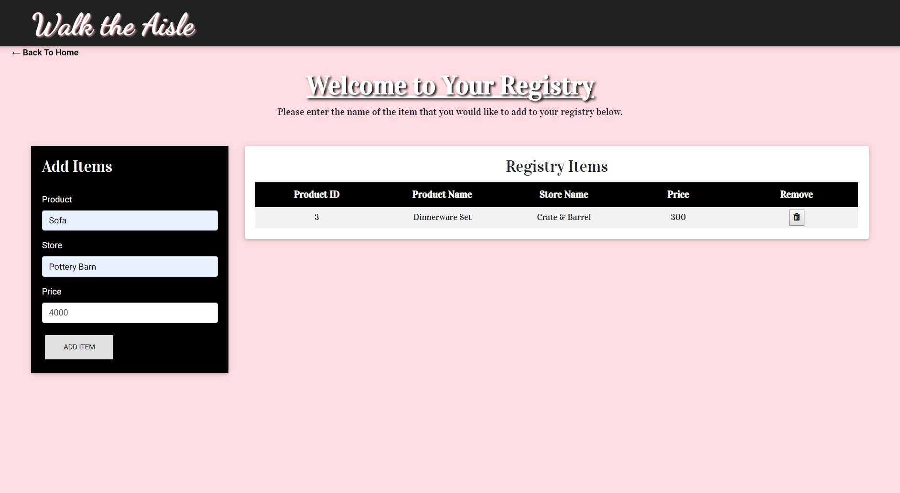
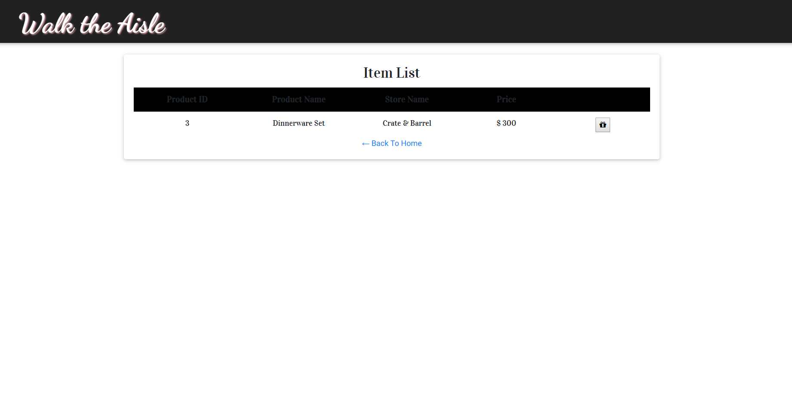

# Walk the Aisle

---------------
## Table of Contents
1. [Abstract](#abstract)
2. [Coding Overview](#overview)
3. [Application Display](#display)

## Abstract

The Walk the Aisle application is designed to help users to create their wedding registry and to allow their friends/families to view the registry list and to choose a gift from the list.

Collaborators: Alexis Rajis, Karen Largent, Pinar Gultekin

Collaborators Roles:
* Prototyping and Design - All
* Custom CSS - Alexis Rajis
* Frontend Dev - Alexis Rajis (primary)
* Backend Dev - Karen Largent & Pinar Gultekin (primary) 
* Research into New Tech - All
* Research, New Tech, and Libraries - All

## Coding Overview

The application is built with;
* HTML
* CSS
* Bootstrap 
* Fontawsome
* MDB
* Javascript
* JQuery 
* AJAX 
* MySQL 
* Balsamiq
* Node.js
* NPM Packages 
  * Express 
  * Sequelize 
  * Chai 
  * Mocha
  * ES Lint
  * Handlebars
  * Animate.css
	
Application link is : 

## Application Display

 

 

 

